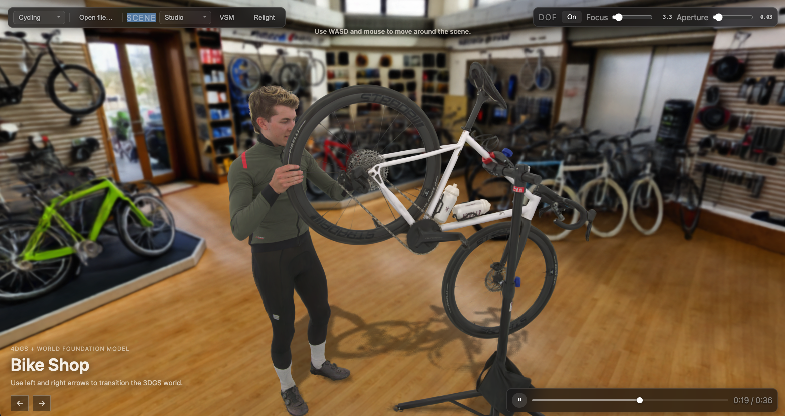

# 4DGS + World Foundation Model Demo

A small web demo that combines streamed <a href="https://gracia.ai/" target="_blank" rel="noopener noreferrer">Gracia.ai</a> 4DGS performers with a World Foundation Model based 3D Gaussian scene from <a href="https://www.worldlabs.ai/" target="_blank" rel="noopener noreferrer">World Labs</a>.

The project is intentionally simple: it is a standalone Vite app using <a href="https://threejs.org/" target="_blank" rel="noopener noreferrer">Three.js</a>, <a href="https://sparkjs.dev/" target="_blank" rel="noopener noreferrer">Spark.js</a>, and the Gracia Web SDK runtime files included in `public/dist`.

It includes 4DGS relighting controls, spatial audio playback, keyboard/mouse navigation, and mobile joystick controls for supported mobile browsers.

This is a fully navigable 3D scene: 4DGS extends 3D Gaussian Splatting with time-varying volumetric capture, making it possible to render dynamic human performances inside the world.



## Getting Started

Install dependencies:

```sh
npm install
```

Build the app:

```sh
npm run build
```

Start the local server:

```sh
npm start
```

Open `http://localhost:4173/`.

## Controls

- Drag to orbit the camera.
- Use `W`, `A`, `S`, and `D` to move through the scene.
- Use the left and right arrow keys to transition between 3DGS worlds.
- Use the on-screen controls to switch Gracia sources, lighting presets, and depth-of-field settings.
- On mobile, use the on-screen joysticks to move and look around.

## Notes

- Requires Node.js 20.19 or newer.
- Gracia 4DGS playback requires a browser and device with WebGPU support, including supported mobile browsers.
- Gracia playback uses `SharedArrayBuffer`, so the page must be cross-origin isolated. The local Vite server sets the required `Cross-Origin-Opener-Policy` and `Cross-Origin-Embedder-Policy` headers automatically.
- Production deployments must serve the same cross-origin isolation headers; static hosts that do not allow custom headers may not support Gracia playback.
- The 3DGS world assets are loaded from `public/assets/3dgs`.
- Streaming source entries live in `public/sources.json`.

## License

This repository is mixed-license:

- Original demo source code is licensed under the [MIT License](LICENSE).
- The Gracia Web SDK runtime files in `public/dist/` are proprietary software owned by Gracia Labs. They may be included publicly only with permission from Gracia Labs and are not covered by the MIT License.
- Third-party libraries and assets are governed by their own licenses and terms.

See [THIRD_PARTY_NOTICES.md](THIRD_PARTY_NOTICES.md) for details.
